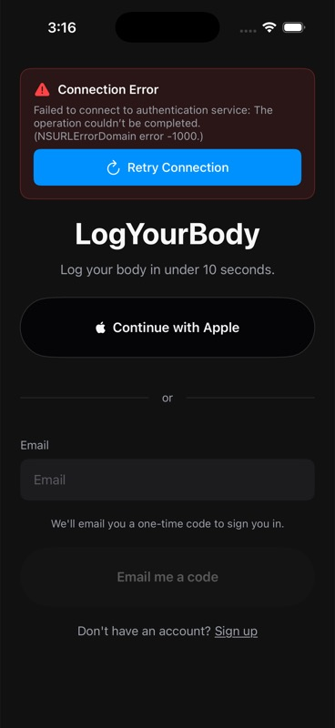
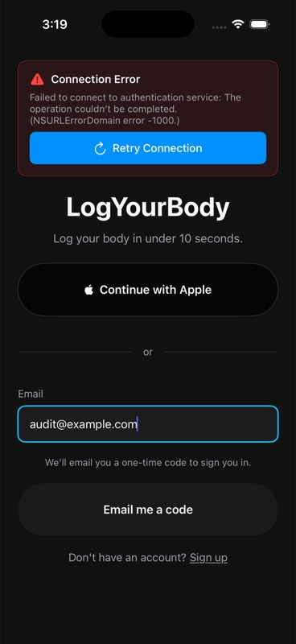
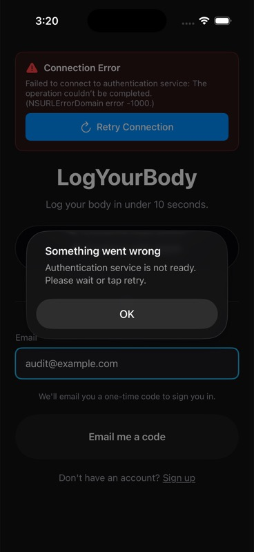

# JOV-2858 Launch Flow And Release Binary Audit

Date: 2026-06-06
Linear: JOV-2858
Branch: `codex/jov-2858-launch-flow-audit`

## Issue Plan

Audit the current `main` iOS launch path before changing auth, paywall, or release behavior.

Scope:
- Identify the exact commit, tag, and build metadata tested.
- Verify the visible signed-out launch path, including email OTP and Apple Sign-In visibility.
- Verify the authenticated paid-MVP routing policy from code and runtime where possible.
- Verify paywall, restore/logout escape, manual weight save, and sync status behavior with the strongest available local evidence.
- Record release/TestFlight/App Store state from repo/workflow metadata and any available external tooling.
- Capture screenshots or command evidence for each tested surface.
- Decide whether Apple Sign-In should be hidden, internally gated, or enabled.

Out of scope:
- Do not fix launch bugs in this issue unless a trivial fix is required to complete the audit.
- Do not submit a release from this issue.
- Do not replace the MVP with the full dashboard.

## Autoplan Review

Decision: proceed with a code-backed and runtime-backed audit artifact before implementation issues.

CEO review:
- Fastest revenue path stays email OTP plus paid weight logging.
- Do not block the paid MVP on Apple Sign-In if Apple can be hidden safely.
- Treat "merged", "uploaded", or "tagged" as insufficient without current runtime evidence.

Design review:
- The visible launch path must follow the dark, quiet, Jovie-style system from `docs/product-development-roadmap.md`.
- Screenshots should capture real rendered states rather than relying on code inspection.
- Any confusing status copy found during audit should be routed to follow-up issue JOV-2860.

Engineering review:
- Current checkout is authoritative; prior auth memory can guide hypotheses but cannot prove current behavior.
- Simulator evidence is acceptable for local UI/runtime inspection, but Apple auth enablement requires real-device proof.
- If local config or provider access blocks evidence, document the blocker precisely instead of guessing.

DX review:
- The final report must be reusable as the handoff artifact for follow-up issues.
- Evidence should include commands, screenshots, logs, and explicit limitations.

## Environment

Audit date: 2026-06-06

Primary source under audit:
- Branch: `codex/jov-2858-launch-flow-audit`
- Base commit: `3482233377b1b30ab853b451b90c74f30713647d`
- Latest release tag on that commit: `ios-v1.2.0-testflight.20260605224412`
- Latest release workflow: `ios-release-loop.yml` run `27043818376`
- Latest release workflow URL: https://github.com/JovieInc/LogYourBody/actions/runs/27043818376

Local simulator evidence:
- Xcode project: `apps/ios/LogYourBody.xcodeproj`
- Scheme: `LogYourBody`
- Configuration: `Debug`
- Simulator: `iPhone 17 Pro`, iOS `26.5`, UUID `1F5679FD-2B72-40E4-816A-4B58E36C032B`
- Local app Info.plist: `CFBundleShortVersionString=1.2.0`, `CFBundleVersion=20251126162826`, `APP_ENVIRONMENT=development`
- Local config: ignored `Config.xcconfig` with non-secret development placeholders. This allowed UI/build inspection only; it did not prove production Clerk, RevenueCat, or Supabase behavior.
- Local build/run result: `build_run_sim` succeeded and launched `com.logyourbody.app`

Validation commands/evidence:

```bash
xcrun xcresulttool get test-results summary \
  --path /Users/timwhite/Library/Developer/XcodeBuildMCP/workspaces/LogYourBody-03988719e21b/result-bundles/test_sim_2026-06-06T22-25-42-783Z_pid45897_972660a2.xcresult \
  --format json
```

Result: `Passed`, `3` tests passed, `0` failed, `0` skipped.

Focused tests executed:
- `LaunchSurfacePolicyTests.testFullDashboardGateRestoresBodyCompositionRequirements`
- `LaunchSurfacePolicyTests.testFullDashboardPolicyMirrorsFeatureGate`
- `LaunchSurfacePolicyTests.testMVPDefaultSkipsBodyCompositionOnboardingAndProfileGate`

Screenshot evidence captured from the simulator:
- `signed-out-local-config.jpg` - signed-out launch screen
- `email-entered-local-config.jpg` - valid email entered and OTP button enabled
- `email-auth-not-ready-local-config.jpg` - email OTP submit with provider not ready under local placeholder config

Each screenshot is `368x800`.

## Code-Backed Findings

Signed-out auth:
- `apps/ios/LogYourBody/DesignSystem/Organisms/LoginForm.swift:29` explicitly states Apple Sign-In is the primary path.
- `LoginForm` renders `SocialLoginButton(provider: .apple)` before the email divider and field (`LoginForm.swift:29-35`).
- The email OTP button text is `Email me a code` and is enabled only when email format is valid (`LoginForm.swift:55-66`).
- No `ios_apple_sign_in_enabled` gate exists yet. The only relevant current iOS launch gate in `Constants.swift` is `ios_full_body_composition_dashboard`.
- `Constants.useMockAuth` is hard-coded `false` in both debug and non-debug builds, so the app does not contain a production auth bypass for this path.

Authenticated routing:
- `ContentView` routes unauthenticated users to login, pending OTP users to email verification, and authenticated users to the paid flow (`ContentView.swift:185-214`).
- Authenticated but unsubscribed users route to `PaywallView` (`ContentView.swift:205-208`).
- Authenticated and subscribed users route to `MainTabView` (`ContentView.swift:209-214`).
- `MainTabView` uses `ios_full_body_composition_dashboard` only to choose between `DashboardViewLiquid` and the MVP `PaidWeightLoggerMVPView` (`MainTabView.swift:14-30`).
- The focused unit tests prove the default MVP policy skips body-composition onboarding/profile completion while the full-dashboard gate restores those requirements (`LogYourBodyTests.swift:10-57`).

Paywall:
- `PaywallView` has purchase, restore, logout, terms, and privacy surfaces visible in code (`PaywallView.swift:21-50`).
- The paywall includes a logout escape through a confirmation dialog that calls `authManager.logout()` (`PaywallView.swift:83-97`, `PaywallView.swift:294-305`).
- The restore button calls `revenueCatManager.restorePurchases()` and records success/failure UI (`PaywallView.swift:280-291`).
- Runtime purchase/restore was not proven in this audit because the local simulator was running placeholder provider config and there is no deterministic test fixture for an authenticated unsubscribed sandbox account yet.

MVP weight logging:
- The subscribed MVP surface is `PaidWeightLoggerMVPView` (`MainTabView.swift:34-498`).
- The screen has stable accessibility identifiers for the sync status, weight field, unit picker, and save button (`mvp_sync_status`, `mvp_weight_text_field`, `mvp_weight_unit_picker`, `mvp_save_weight_button`).
- The save path validates the entered weight, converts to kg when needed, creates `BodyMetrics(dataSource: "Manual")`, saves local-first with `markAsSynced: false`, and then asks `RealtimeSyncManager` to sync (`MainTabView.swift:393-445`).
- The post-save success copy is currently just `Saved`; sync copy can be `Pending`, `Ready`, `Syncing`, `Synced`, `Sync issue`, or `Offline` (`MainTabView.swift:346-358`).
- Keyboard/save ergonomics and sync copy are credible follow-up scope for JOV-2860. They were not runtime-proven here because the audit did not use a production auth or subscription bypass.

Full app/source material:
- The full body-composition dashboard still exists behind `ios_full_body_composition_dashboard`.
- This matches the roadmap decision: use the full app as source material for the later HUD lane, not as the launch default.

## Runtime Evidence

### Signed-Out Launch



Observed on simulator:
- Dark launch screen rendered successfully.
- A red `Connection Error` banner was visible because local placeholder Clerk config could not initialize the auth service.
- `Continue with Apple` was visible and placed before the email path.
- The email field and disabled `Email me a code` button were visible.
- Common-sense UI review: the dark, quiet visual direction is broadly aligned with the roadmap, but Apple being the primary visible action conflicts with the launch-lane decision to make email OTP primary until Apple has real-device proof.

UI snapshot targets included:
- `Retry Connection`
- `Continue with Apple`
- `Email` text field
- `Sign up`

### Email OTP Entry



Observed on simulator:
- Typing `audit@example.com` enabled `Email me a code`.
- This proves the local field validation/enabled-state path renders and responds to input.

### Email OTP Submit Under Placeholder Config



Observed on simulator:
- Tapping `Email me a code` produced `Something went wrong`.
- Alert body: `Authentication service is not ready. Please wait or tap retry.`
- This is expected under placeholder local config and does not prove production OTP failure.
- Production email OTP still needs real provider-backed proof in the release loop.

Runtime log note:
- Statsig logged: `Must start Statsig first and wait for it to complete before calling checkGate. Returning false as the default.`
- In this local launch, that means the full-dashboard flag was treated as off, keeping the paid MVP route as the default policy when authenticated/subscribed.

### Paywall, Purchase/Restore, Logout

Runtime state: code-backed only.

Reason:
- Local simulator auth could not establish a real user session with placeholder Clerk config.
- The audit intentionally did not add or use a production auth, billing, or privacy bypass.

Evidence:
- Code routes authenticated unsubscribed users to `PaywallView`.
- Code exposes restore and logout escape controls.
- The latest release workflow verified the RevenueCat offering before uploading to TestFlight.

Limitation:
- Purchase, restore, and logout must still be proven with sandbox/TestFlight evidence in JOV-2862.

### Manual Weight Save and Sync Status

Runtime state: code-backed only.

Reason:
- The MVP weight screen is behind authenticated and subscribed state.
- No deterministic fixture exists yet to reach that state safely without production auth/billing.

Evidence:
- Code shows the local-first save path and sync request.
- Focused launch policy tests prove paid MVP routing is the default when the full-dashboard gate is off.

Limitation:
- The actual keyboard-open save/post-save UX and human-readable sync copy need deterministic UI smoke and live simulator evidence in JOV-2860 and JOV-2863.

## Release State

GitHub release workflow:
- `ios-release-loop.yml` run `27043818376` completed successfully on `2026-06-05`.
- Head branch: `main`
- Head SHA: `3482233377b1b30ab853b451b90c74f30713647d`
- Display title: `feat: add iOS product design guardrails`
- Jobs:
  - `Validate Release`: success
  - `Check Existing Build`: success
  - `Build Release`: success
  - `Deploy to TestFlight / Deploy to TestFlight (production)`: success
  - `Deploy to App Store`: skipped
  - `Create Release`: success

GitHub release:
- Tag: `ios-v1.2.0-testflight.20260605224412`
- Build number: `20260605224412`
- Version: `ios-v1.2.0`
- Deployment: `testflight`
- Environment: `Production`
- Published: `2026-06-05T22:56:12Z`
- Release URL: https://github.com/JovieInc/LogYourBody/releases/tag/ios-v1.2.0-testflight.20260605224412
- Release body states TestFlight is available for all testers.

RevenueCat/App Store evidence:
- The release workflow's `Verify RevenueCat iOS offering` step passed.
- Existing provisioning notes record the expected current offering: `$rc_annual:com.logyourbody.app.pro1.annual.3daytrial` and `$rc_monthly:com.logyourbody.app.pro1.monthly.3daytrial`.
- App Store deployment was skipped in the latest release-loop run.
- App Store sale/submission state was not directly queried from local tooling during this audit.

Release conclusion:
- Current evidence proves the latest `main` commit built and uploaded a TestFlight production build.
- It does not prove App Store submission/approval.
- It does not prove the actual user path on a physical device.

## Apple Sign-In Visibility Decision

Decision: hide or internally gate Apple Sign-In for the paid MVP launch until it has current real-device proof.

Rationale:
- Apple is visible and primary by default today.
- It is not guarded by a signed-out-safe local default gate.
- Prior fixes made Apple auth more credible, but this audit did not prove the latest TestFlight binary activates a session on a physical device.
- The local simulator run could not prove Apple because provider-backed auth was unavailable with placeholder config.
- Email OTP is the intended launch-primary path and should not be visually secondary while Apple remains unproven.

Follow-up implementation target:
- JOV-2859 should add `ios_apple_sign_in_enabled` with a local signed-out default of `false`.
- Email OTP should become the primary visible signed-out path.
- Apple Sign-In should be shown only for internal/proven cohorts until JOV-2865 supplies physical-device proof.

## Follow-Up Routing

Launch lane:
- JOV-2859: gate Apple Sign-In availability and keep email OTP primary. This is the immediate launch-risk reducer.
- JOV-2860: fix MVP weight logging keyboard/save/post-save UX and improve sync copy.
- JOV-2862: verify RevenueCat paywall purchase, restore, and escape paths with sandbox/TestFlight evidence.
- JOV-2863: add deterministic MVP UI smoke coverage and evidence capture without auth/billing/privacy bypasses.
- JOV-2864: close App Store submission and release-loop evidence.
- JOV-2865: restore or enable Apple Sign-In with physical-device proof.

HUD lane:
- Use the current full body-composition dashboard as design/source material only after the paid MVP path is stable.
- Keep `ios_full_body_composition_dashboard` as legacy/beta until the photo-first HUD has screenshots, state matrix, and device review.

Audit done when:
- This report is committed and linked from JOV-2858.
- The Linear issue records the Apple visibility decision and the limits of current TestFlight/runtime evidence.
